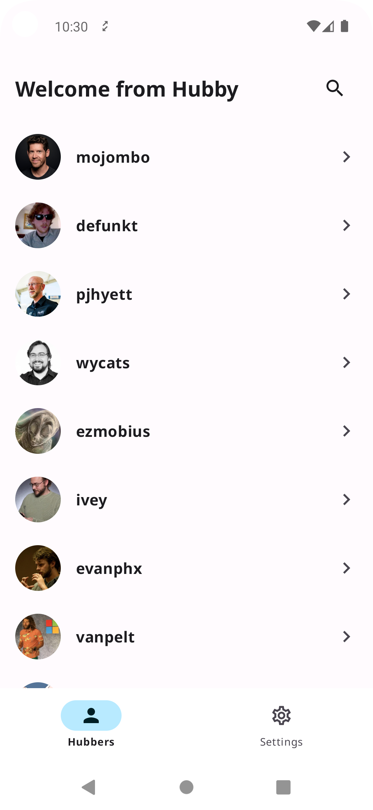
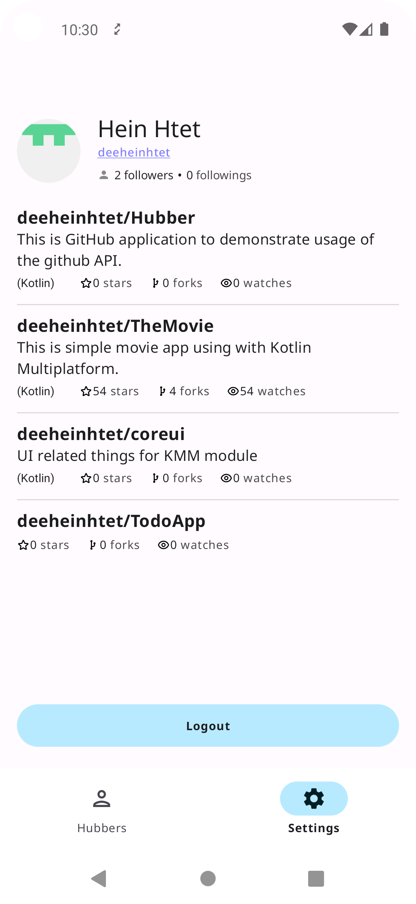
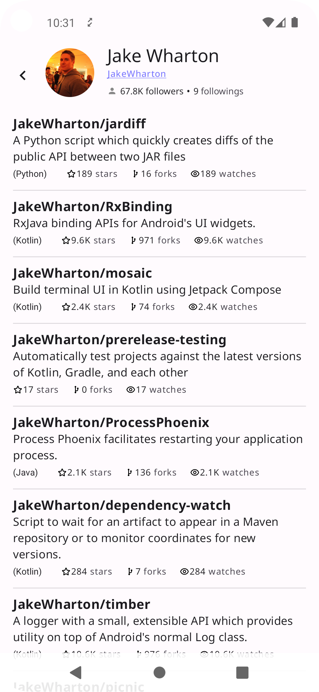

# HUBBER 

This is simple application for github application. It demostrates how to use the Github API and OAuth integration for github application.
## Features
1. Integration with github OAuth Authentication.
2. Github user list and able to search with the name.
3. Repository list for each Github user. 
4. Support Dark/White mode.

## Tech Stacks

1. MVVM architecture and modularization
2. Jetpack compose for UI design
3. Coroutine flow for async 
4. JNI integration for security
5. Dagger Hilt for dependency injection
6. Retrofit and OKHttp for networking
7. Chucker for network logs
8. Moshi for JSON encode/decode
9. Truth, Mockito, mockk for unit testing

## Screenshots

  
  

  
  

